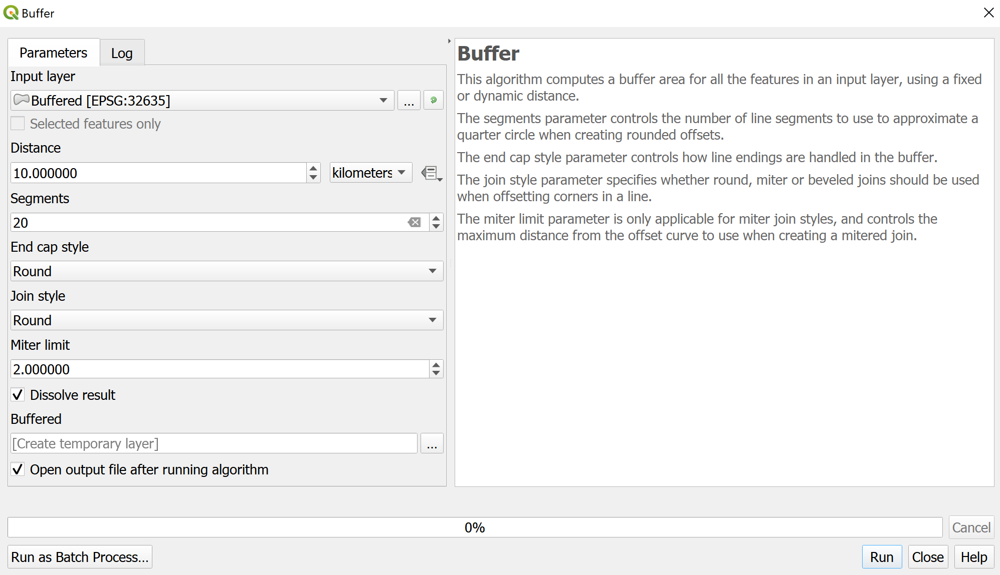

> [GIS fundamentals | Training Course](agenda.md) ▸ **Creating buffers (infected & surveillance zones)**

## Targeted skills
By the end of this module, you will know how to:
* create zone (buffers) around features of interest (points, lines, polygons)
* dissolve individual buffers into one single zone

## Data
Data to be used in this module is the one produced in previous module and complying with the following requirements:
* ASF (Avian Swine Fever) outbreaks
* Romania outbreaks only
* re-projected in UTM 35N

## Exercise outline & memos

A buffer in GIS is simply a zone around a map feature measured in units of distance or time. A buffer is useful for [proximity analysis](https://en.wikipedia.org/wiki/Proximity_analysis).

During diseases outbreaks and responses to be given, it is often required to create infected and/or surveillance zones. We will see in this module that this can be done very easily.

### Creating zones (buffers)

Open your layer of interest 

```
[In QGIS top menu or in Processing Toolbox panel (write buffer in the search bar)] 
Vector ▸ Geoprocessing Tools ▸ Buffer(s)...
```

Once "Buffers" window/dialog opened, you will notice that a distance should be specified. As we have already re-projected, we have the choice to specify the distance in a metric system (otherwise distance would have been specified in degrees -which we are not used to).

Specify the following settings:



The dissolve checkbox allows to create the union of individual buffers created.

Check with the ruler that the buffers cover regions of 10km radius.

Now, save and style the buffer layer and overlay it over Google Maps.


