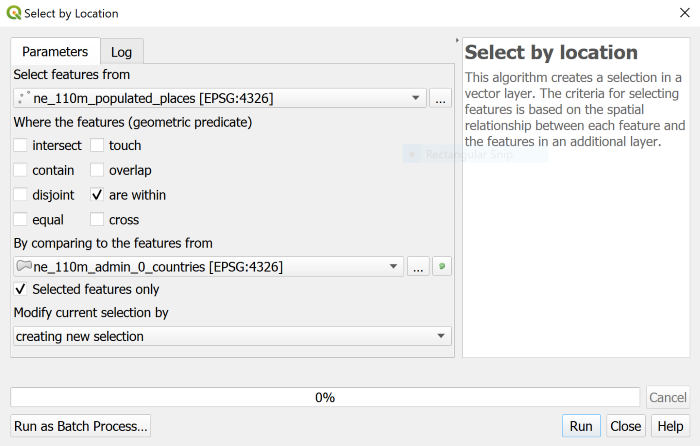

> [GIS fundamentals | Training Course](agenda.md) ▸ **Opening & overlaying GIS layers**

## Targeted skills
By the end of this module, you will know how to:
* open shapefiles
* show attribute tables
* browse the map: zoom (in, out, to region), pan, ...
* select features: individually, by regions, by attribute value, through spatial query
* change the order of layers
* access layers properties
* style map features (basic)
* save open layers, styling in a QGIS project

## Data
Data to be used in this module can be found in the following folders:
```
data/ne_110m_admin_0_countries/
data/ne_110m_populated_places/
data/ne_110m_rivers_lake_centerlines/
```
## Exercise outline & memos

**IMPORTANT PRELIMINARY NOTE:** Create a favorite to the workhop downloaded folder for easy access. To do so, simply browse your file system and in:

```
[QGIS Browser] 
Click right to your folder of interest and ▸ Add as a Favorite
```

### 1. Opening a shapefile

Option 1:
```
[In QGIS top menu] 
Layer ▸ Add Layer ▸ Add Vector Layer  
```

Option 2:
```
[In QGIS Browser] 
Double click on the file/layer of interest or drag and drop
```

Option 3:
```
[In QGIS toolbar] 
Add Vector Layer
```
Hint: *function of icons will appear when hovering over it*

[Check out QGIS User Guide for more information](https://docs.qgis.org/3.4/en/docs/training_manual/index.html)

Shapefiles to be open in this exercise are:
```
data/ne_110m_admin_0_countries/ne_110m_admin_0_countries.shp
data/ne_110m_populated_places/ne_110m_populated_places.shp
data/ne_110m_rivers_lake_centerlines/ne_110m_rivers_lake_centerlines.shp
```
Warning: *note that what we called a shapefile is actually a combination of files with the following extensions: .shx, .shp, .dbf, ... When we want to open a shapefile in GIS software, we are opening the .shp one.* [See wikipedia entry for shapefile](https://en.wikipedia.org/wiki/Shapefile).

### 2. Showing attribute table
A GIS layer has always two facets, representations: geographical (the map itself) and attribute table (tabular) representations.

In the attribute table, each row corresponds to a map feature (a point, a line or a polygon) and columns attributes recorded for this feature (population, type of disease, ...).

To open the attribute table:

Option 1:
```
[In QGIS top menu] 
Layer ▸ Open Attribute Table
```

Option 2:
```
[In QGIS top toolbar] 
Click the 'table' icon
```

Option 3:
```
[In QGIS Layers list] 
Click right on the layer of interest and select 'Open Attribute Table'
```

### 3. Browsing the map
Option 1:
```
[In QGIS top menu] 
View ▸ Zoom Full
  or
View ▸ Zoom to Layer
...
```
Option 2:
```
[In QGIS top toolbar] 
```
Hint: *you will find a series of buttons with magnifiers icon. Play around ...*

### 4. Select features
Option 1:
```
[In QGIS top menu] 
Edit ▸ Select ▸ ...
```

Option 2:
```
[In QGIS top toolbar] 
```

#### 4.1 Select by attribute value
```
[In QGIS top menu] 
Edit ▸ Select ▸ Select by Expression ...
```
then in [input text box], write:
```
"pop_est"  > 50000000  and click 'Select features' button.
```

#### 4.2 Select by spatial query

First open the **Processing Toolbox**. This toolbox centralizes in this new QGIS 3 version many of the analytical tools (for both vector and raster data) previously scattered here and there in previous QGIS versions or only available through specific QGIS Plugins. To open it, simply:

```
[In QGIS top menu] 
Processing ▸ Toolbox 
```

Now, select a country, let's say "Brazil" then: 

```
[In the Processing Toolbox]
Vector Selection ▸ Select by location

[In "Select features from" dropdown]
Choose: "ne_110m_populated_places"

[In "Where the features" dropdown]
Choose: "are within"

[In "By comparing to the features from"]
Choose: "ne_110m_admin_0_countries" 
Check: Selected features only)

Then click "Apply"
```


### 5. Changing order of layers

```
[In Layers Panel]
Simply drag and drop layers you want to move up or down in layers stack
```

### 6. Accessing layer properties
```
[In Layers Panel]
Click right on layer of interest ▸ Properties
```
then, on left side of the properties window, you will find a bunch of choice/option, such as:
* Information
* Source
* Symbology
* ...

We will only focus on "Symbology" properties for now.

### 6. Styling map features
```
Open layer properties
Click "Symbology" option and play around with colours to your liking;
```

### 7. Saving open layers and styles as QGIS project

To save your QGIS environment/project:
```
[In QGIS top menu] 
Project ▸ Save As...
```
