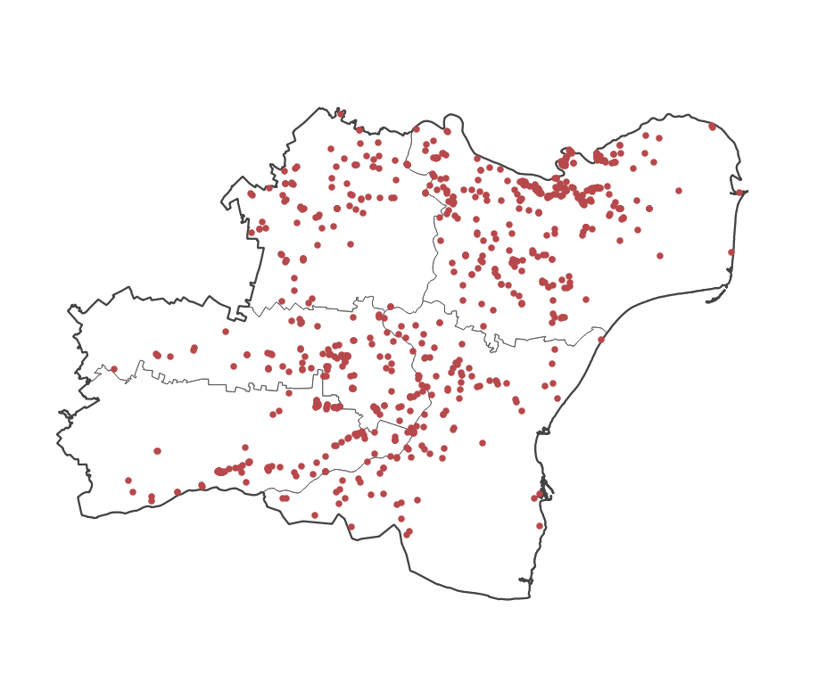

> [GIS fundamentals | Training Course](agenda.md) ▸ **Spatial aggregation techniques**

## Targeted skills
By the end of this module, you will know how to:
* generate a grid with custom extent and resolution
* clip a grid with a polygon layer
* aggregate spatially an underlying point layers and produce a thematic map (but you know it already!)


## Data

## Exercise outline & memos

In this module, given our previous analysis, we would like to perform a fine-grained analysis of the outbreak situation at a higher resolution (large scale) in the south west of Romania, especially in these counties:
* Ialomița
* Constanța
* Călărași
* Brăila
* Tulcea

### 1. Data preparation

Your tasks:

1. Select counties of interest and save it as new layer
2. Select ASF outbreaks data covered by this new area of interest
3. Save it as a new layer

Once, this is done, we would like to create a new layer with one single feature/polygon representing the contour of the area formed by 5 counties selected. This transformation is called **dissolving**. 

```
[In QGIS Processing Toolbox]
Write "dissolve" in the search box
and double-click on Vector geometry  ▸ Dissolve 
Choose the layer of interest and "Run"
Save it as new layer
```

By now, you should have three new layers (see screenshot below):
* the ASF outbreaks for these 5 counties
* the 5 counties selected as a new layer
* a layer with one single feature representing the contour of these 5 counties




### 1. Opening a shapefile

Option 1:
```
[In QGIS top menu] 
Layer ▸ Add Layer ▸ Add Vector Layer  
```

Option 2:
```
[In QGIS Browser] 
Double click on the file/layer of interest or drag and drop
```

Option 3:
```
[In QGIS toolbar] 
Add Vector Layer
```
Hint: *function of icons will appear when hovering over it*

[Check out QGIS User Guide for more information](https://docs.qgis.org/3.4/en/docs/training_manual/index.html)

Shapefiles to be open in this exercise are:
```
data/ne_110m_admin_0_countries/ne_110m_admin_0_countries.shp
data/ne_110m_populated_places/ne_110m_populated_places.shp
data/ne_110m_rivers_lake_centerlines/ne_110m_rivers_lake_centerlines.shp
```
Warning: *note that what we called a shapefile is actually a combination of files with the following extensions: .shx, .shp, .dbf, ... When we want to open a shapefile in GIS software, we are opening the .shp one.* [See wikipedia entry for shapefile](https://en.wikipedia.org/wiki/Shapefile).

### 2. Showing attribute table
