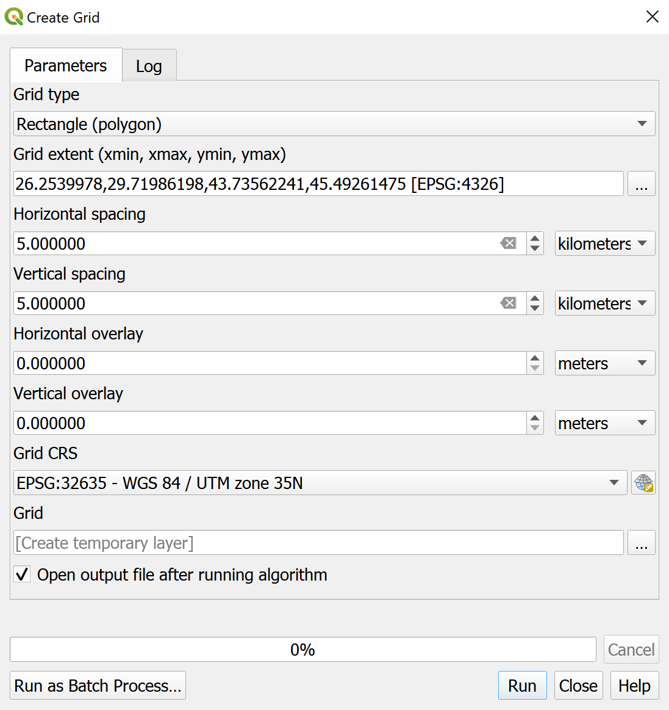
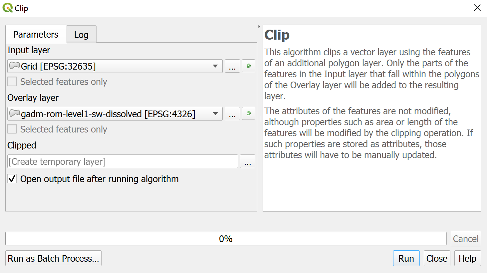

> [GIS fundamentals | Training Course](agenda.md) ▸ **Spatial aggregation techniques**

## Targeted skills
By the end of this module, you will know how to:
* generate a grid with custom extent and resolution
* clip a grid with a polygon layer
* aggregate spatially an underlying point layers and produce a thematic map (but you know it already!)


## Data

## Exercise outline & memos

In this module, given our previous analysis, we would like to perform a fine-grained analysis of the outbreak situation at a higher resolution (large scale) in the south west of Romania, especially in these counties:
* Ialomița
* Constanța
* Călărași
* Brăila
* Tulcea

### 1. Data preparation

Your tasks:

1. Select counties of interest and save it as new layer
2. Select ASF outbreaks data covered by this new area of interest
3. Save it as a new layer

Once, this is done, we would like to create a new layer with one single feature/polygon representing the contour of the area formed by 5 counties selected. This transformation is called **dissolving**. 

```
[In QGIS Processing Toolbox]
Write "dissolve" in the search box
and double-click on Vector geometry  ▸ Dissolve 
Choose the layer of interest and "Run"
Save it as new layer
```

By now, you should have three new layers (see screenshot below):
* the ASF outbreaks for these 5 counties
* the 5 counties selected as a new layer
* a layer with one single feature representing the contour of these 5 counties


### 2. Generate and clip grid

Now, we would like to generate a grid of 5km resolution. To do so:

```
[In QGIS Processing Toolbox]
Write "grid" in the search box
and double-click on Vector creation  ▸ Create grid 
and reproduce the settings below:
```



And finally, let's **clip** (using region of interest as a countour to the newly created grid):

```
[In QGIS Processing Toolbox]
Write "clip" in the search box
and double-click on Vector overlay  ▸ Clip
and reproduce the settings below:
```



