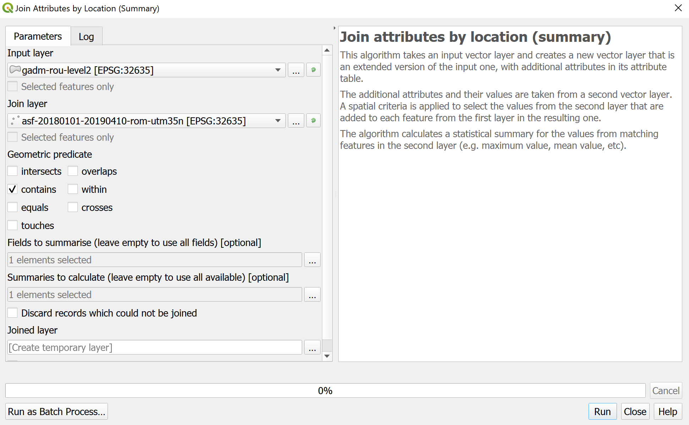

> [GIS fundamentals | Training Course](agenda.md) ▸ **Zonal statistics and thematic mapping**


## Targeted skills

By the end of this module, you will know how to:
* aggregate outbreaks statistics at "commune" level (sum, mean, ...)
* create a thematic map

## Data
Data to be used in this module are:
* ASF (African Swine Fever) outbreaks reprojected and focused on Romania produced in previous modules
* `data/gadm36_ROU_shp/gadm36_ROU_1.shp`
* and `data/gadm36_ROU_shp/gadm36_ROU_2.shp`

## Exercise outline & memos

### 1. Calculating zonal statistics
To report the outbreaks situation, it is often required to do so at various administrative levels. For instance, to report the number of cases in each "commune" in Romania (administrative level 2 of our dataset).

After having opened the three layers required, to perform this aggregation in QGIS:
```
[In QGIS Processing Toolbox] 
1. In the search box, type: "join attributes by location"
2. Then reproduce the settings below with
  * "SumCases" as "Fields to summarise " and
  * "sum" as "Summaries to calculate..."
```


