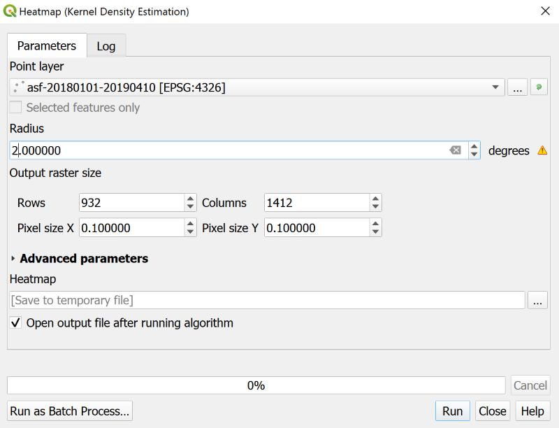
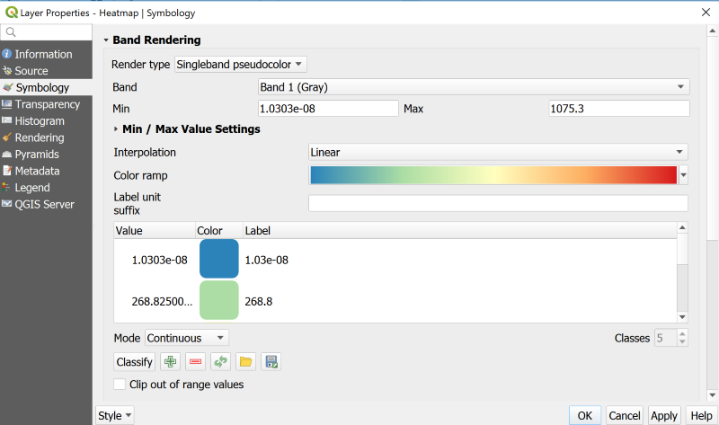

> [GIS fundamentals | Training Course](agenda.md) ▸ **Zonal statistics and thematic mapping**


## Targeted skills

By the end of this module, you will know how to:
* aggregate outbreaks statistics at "commune" level (sum, mean, ...)
* create a thematic map

## Data
Data to be used in this module are:
* ASF (African Swine Fever) outbreaks reprojected and focused on Romania produced in previous modules
* `data/gadm36_ROU_shp/gadm36_ROU_1.shp`
* and `data/gadm36_ROU_shp/gadm36_ROU_2.shp`

## Exercise outline & memos

In this series of module, we will focus on **ASF (African Swine Fever) outbreaks data in Romania from 1st January 2018 to 10th April 2019**.

### 1. Practice "Day 1" acquired skills

* first, open "CartoDB Positron" XYZ tiles
* then load the `data/asf-20180101-20190410.csv` .csv file into QGIS and convert it to a Shapefile

### 2. Take a quick look at outbreaks density worldwide with a Heatmap

You might have noticed that visualizing raw ASF data at world scale resuts in an overcrowded and cluttered map making it difficult to assess visually the density of outbreaks worldwide. We will perform various data analysis in the next module, but for now, let's use a technique called "Heatmap" allowing to quickly visually assess points density.

This type of visualization is quite popular and have its pros and cons but is often a good first step. To create a Heatmap with QGIS3:

```
[QGIS Processing Toolbox] 
1. In the search box, type: "heatmap"
2. Then double-click on Interpolation ▸ Heatmap (Kernel Density Estimation)
3. And finally reproduce the settings below
```



Choosing the right Heatmap settings/parameters is a trial and error process and there is not defined methodology. In a nutshell and intuitively, a heatmap counts the number of points a given area (radius of influence). Technically speaking, it simply estimates a 2D probabilty density distribution using points location as samples from a theoretical one. We will later on go through more relevant and predictable way to look at points/outbreaks density including as well the possibilities to aggregate data (sum, mean, ...) at a given resolution ...

By now, you should have a new layer in your Layer panel with the following name "Heatmap". Let's now adjust the symbology and color rendering.
```
[QGIS Layer Panel] 
1. Double-click on "Heatmap" newly generated layer
2. Reproduce the settings below
```



*Given your color palette, you might need to invert it. To do so, click the "ColorRamp" dropdown and select "Invert Color Ramp"*

### 3. Getting access to countries administrative boundaries
Given previous visual assessment, we've identified high densities of outbreaks in Romania and Poland. Let's use further assess Romania's situation in this module (Poland case is let as an exercise). 

In later modules, we will aggregate the outbreaks data, getting the sum of cases or others at county levels, regional levels or in a generated grid. Finding, authoritative administrative boundaries data is not always a simple process (as they might change quite regularly). The safest way is to ask these data to your country's agency in charge (Statistical office, National Mapping Agency, ...). However, a first often very relevant data source is the GADM data portal, a global database of administrative areas.

* You can reach this data portal at this url: https://gadm.org/index.html
* And download, the shapefiles of your country of interest at this url: https://gadm.org/download_country_v3.html
* In our case, let's download the shapefiles for Romania: https://biogeo.ucdavis.edu/data/gadm3.6/shp/gadm36_ROU_shp.zip
