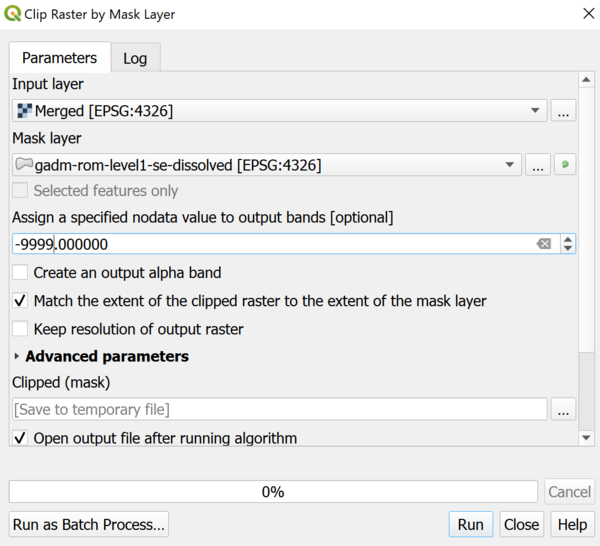
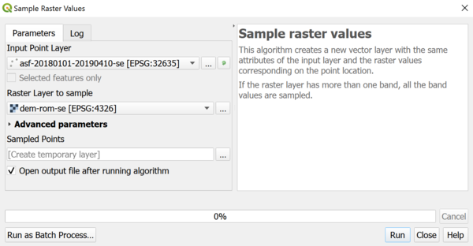

> [GIS fundamentals | Training Course](agenda.md) ▸ **Digital Elevation Model and raster analysis**

## Targeted skills
By the end of this module, you will know how to:
* download Digital Elevation Model from NASA Shuttle Radar Topographic Mission (SRTM)
* merge and clip tiles/images downloaded
* visualize in 2D and 3D Digital Elevation Model
* sample altitude at outbreak locations


## Data
* Romania administrative levels
* ASF outbreaks

## Exercise outline & memos

### 1. Downloading SRTM data
The **Shuttle Radar Topography Mission (SRTM)** is an international research effort that obtained digital elevation models on a near-global scale. For more information, look at the wikipedia entry: https://en.wikipedia.org/wiki/Shuttle_Radar_Topography_Mission.

These data are directly accessible and downloadable from QGIS via the "SRTM Downloader" plugin. Install this plugin. To use it you will need to create an account (free) at https://urs.earthdata.nasa.gov/

In day 2, we have focused our analysis on the southeast part of Romania. We will continue analysing this region.

Your task:
* Open the following layer `data/gadm36_ROU_shp/gadm-rom-level1-sw.shp`
* Zoom to the extent of this newly loaded layer
* then:

```
[In QGIS Top Menu]
Plugins  ▸ SRTM-Downloader  ▸ SRTM Downloader
Press on "Set Canvas Extent" and click "Download"
Now you will be asked to provide your Login and Password
A series of about 12 raster layers (images) will be downloaded 
```


### 2. Merging and clipping SRTM individual scene
The next steps are to merge (combine all scenes in one single one) and clip the extent based on `gadm-rom-level1-sw.shp` layer.

To **merge** all downloaded scenes:

```
[In QGIS Processing Toolbox]
Write "merge" in the search box
Double click on GDAL ▸ Raster Miscellaneous ▸ Merge
```


You should have a new layer named "Merged"
Remove all individual scenes and keep this last one.

Now, let's **clip** this last layer using our `gadm-rom-level1-sw.shp` layer:

```
[In QGIS Processing Toolbox]
Write "clip" in the search box
Double click on GDAL ▸ Raster extraction ▸ Clip raster by mask layer
Last, reproduce the settings below:
```



Save the newly created raster layer as a Geotiff file:
```
[In QGIS Layer Panel]
Right-click on the newly clipped layer
Export ▸ Save As...
Select "GeoTiff" format
```


### 3. Styling and visualizing

Open the newly created raster layer. By default, it will appear in black and white. We will see how to adjust, specify color palettes for raster images.

Raster images can have multiple bands (the case of sattelite images with visible bands + near infrared + ...). In the present case we have one single band containing the altitude averaged at 30m resolution. 

We will now apply a "Single band pseudo color" color scheme as shown below:


This is also possible to visualize the Digital Elevation Model in 3D. To do so:

```
[In QGIS Top Menu]
View ▸ New 3D Map View
Click on the "wrench" icon to emphasize the altitude...
To navigate both in 2D and 3D planes, handle simultaneously your mouse and "Shift" key
```


### 4. Adding altitude measurements to ASF outbreaks data
To further investigate ASF outbreaks data in your region of interest, you might want to acquire (if not yet available) the altitude of each reported outbreak.

Several options are available:
* one through an online tool http://www.gpsvisualizer.com/elevation where you upload your data and get back the altitude associated to each lon/lat;
* another one, harnessing the Digital Elevation Model we know have at our disposal.

We will use the second option:

* Open your DEM raster layer
* Open your ASF outbreaks vector layer to be associated with altitude then

```
[In QGIS Processing Toolbox]
Write "sample" in the search box
Double-clik on Raster analysis ▸ Sample raster values
Reproduce the settings below:
```


Now, you can save the newly created layer and perform selection, analysis based on altitude.
