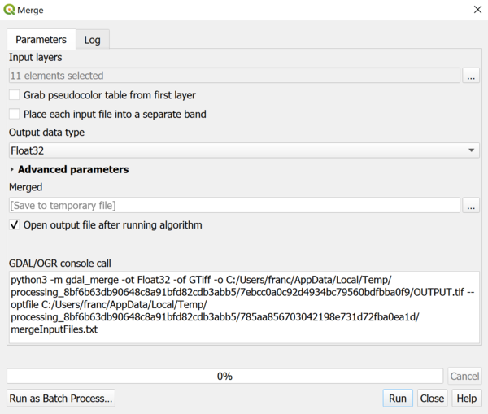

> [GIS fundamentals | Training Course](agenda.md) ▸ **Digital Elevation Model and raster analysis**

## Targeted skills
By the end of this module, you will know how to:
* download Digital Elevation Model from NASA Shuttle Radar Topographic Mission (SRTM)
* merge and clip tiles/images downloaded
* visualize in 2D and 3D Digital Elevation Model
* sample altitude at outbreak locations


## Data
* Romania administrative levels
* ASF outbreaks

## Exercise outline & memos

### 1. Downloading SRTM data
The **Shuttle Radar Topography Mission (SRTM)** is an international research effort that obtained digital elevation models on a near-global scale. For more information, look at the wikipedia entry: https://en.wikipedia.org/wiki/Shuttle_Radar_Topography_Mission.

These data are directly accessible and downloadable from QGIS via the "SRTM Downloader" plugin. Install this plugin. To use it you will need to create an account (free) at https://urs.earthdata.nasa.gov/

In day 2, we have focused our analysis on the south-west part of Romania. We will continue analysing this region.

Your task:
* Open the following layer `data/gadm36_ROU_shp/gadm-rom-level1-sw.shp`
* Zoom to the extent of this newly loaded layer
* then:

```
[In QGIS Top Menu]
Plugins  ▸ SRTM-Downloader  ▸ SRTM Downloader
Press on "Set Canvas Extent" and click "Download"
Now you will be asked to provide your Login and Password
A series of about 12 raster layers (images) will be downloaded 
```


### 2. Merging and clipping SRTM individual scene
The next steps are to merge (combine all scenes in one single one) and clip the extent based on `gadm-rom-level1-sw.shp` layer.

To merge all downloaded scenes:

```
[In QGIS Processing Toolbox]
Write merge in the search box
Double click on GDAL ▸ Raster Miscellaneous ▸ Merge
```



You should have a new layer named "Merged"
Remove all individual scenes and keep this last one.

Now, let's clip this last layer using our `gadm-rom-level1-sw.shp` layer:

```
[In QGIS Processing Toolbox]
Write merge in the search box
Double click on GDAL ▸ Raster Miscellaneous ▸ Merge
```


Sample raster values

