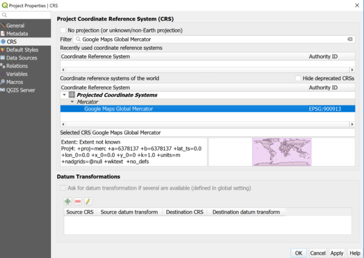

> [GIS fundamentals | Training Course](agenda.md) ▸ **Handling Coordinate Reference Systems (CRS)**

Often, for GIS apprentices, having to deal with Coordinate Reference System is where things are getting confusing! Demystifying this topic is of the highest importance and will allow you to cross this "GIS entry barrier". This is the main purpose of this module.

## Targeted skills
By the end of this module, you will know how to:
* identify the Coordinate Reference System (CRS) of your GIS layer
* know the difference between the CRS of your project and your layers
* change & persist CRS and map projection of a shapefile

## Prerequisites
The short lecture/presentation on Coordinate Reference System should be attended first and will be given prior to this module during the workshop.

## Data
Data to be used in this module can be found in the following folders:
```
data/ne_110m_admin_0_countries/
```
## Exercise outline & memos

### 1. What is the CRS of your layers?

Open: 
```
data/ne_110m_admin_0_countries/ne_110m_admin_0_countries.shp
```

then: 

```
[In QGIS layers panel] 
Click right on the layer recently opened to access its ▸ 'Properties' then select the 'Source' tab.
```
Notice that in the status bar (bottom part of the screen), coordinates displayed in lon, lat.

### 2. Layer vs. QGIS Project CRS
It is quite frequent to get GIS layers (either vector or raster ones) in different CRS systems. In such situation, one solution is to transform all layers into a single, unique CRS. However, this is not always convenient and might be a cumbersome process for instance, if you have many layers and you just want to quickly visualize, explore these layers. To address this use case, QGIS transform "On the fly" all GIS layers opened into a single one; by default the CRS of the first layer opened but it can be configured as well.

At this point, you should have already the `data/ne_110m_admin_0_countries/ne_110m_admin_0_countries.shp` layer in your `[QGIS layers panel]`.

Now: 

```
[In QGIS top menu] 
Project ▸ Properties ▸ CRS (tab)
```

You should see the CRS used to reproject "On the fly" every layers opened (for now only one).

As shown below: 

* in `filter` write: `Google Maps Global Mercator` to find out the CRS of interest;
* select it in the `Coordinate Reference System` list and apply/OK.



Now, your layer (the world countries) should be re-projected into the newly selected "On the fly" projection.

Notice as well that in the status bar (bottom part of the screen), coordinates are not anymore in lon, lat but in x,y meters.

**Qestions:**

* What are the pros and cons of such projection?
* Is the CRS of your layer/shapefile changed?

Play around with various CRS to see their variety.

**Now, I know your burning question!! Which one to use?**

### 3. Changing and persisting CRS of a layer/shapefile

In the previous case, the CRS associated to the layer/shapefile was not changed but simply update "on the fly" dynamically. If you want to change the CRS for a layer you should do the following:

```
[In QGIS top menu] 
Project ▸ Properties ▸ CRS (tab)
```


```
[In QGIS Layers list] 
Click right on the layer of interest ▸ Export ▸ Save Features As...
then you change the CRS via the CRS dropdown and save it (preferably with an explicit name)
```

### 4. [BONUS] Assessing how biased and subjective could be the choice of a CRS

Open the following project:

```
[In QGIS top menu] 
Project ▸ Open  ▸ "data\ne_110m_admin_0_countries\demo\projections-mismatch project"
```

The same layer (world countries) have been created projected in Mercator and Eckert IV CRS and projection on the fly disabled. Look how different they are... Again, pros and cons?


