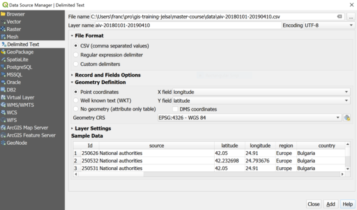
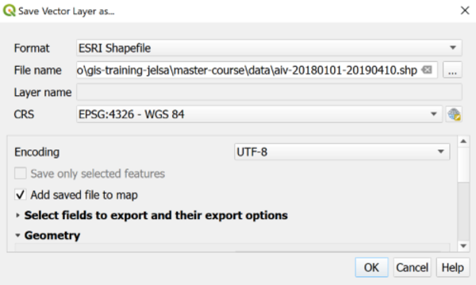
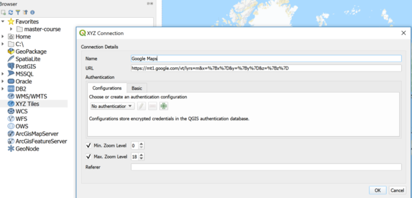

> [GIS fundamentals | Training Course](agenda.md) ▸ **Importing Geo-referenced EMPRES Excel files**

## Targeted skills
By the end of this module, you will know how to:
* convert Excel file to csv (comma separated value) files
* import/convert csv file with lat, lon attributes into GIS layer
* overlay layer created over GoogleMap or OpenStreeMap layers

## Data
Data to be used in this module can be found in the following folders:
```
aiv-20180101-20190410.xlsx
aiv-20180101-20190410.csv
```

These files contain Avian Influenze Virus (AIV) data from 2018/01/01 to 2019/04/10 worldwide provided by the ["EMPRES: Global Animal Disease Information System" platform](http://empres-i.fao.org/eipws3g/)

## Exercise outline & memos

### 1. Converting Excel files to csv format
*CSV stands for Comma-Separated Value*

Before being able to import your data into QGIS as a plain GIS layer, you need to pre-process it via Microsoft Excel or OpenOffice for instance.

To do so for instance with Microsoft Excel:

```
Open: aiv-20180101-20190410.xlsx

[In Excel top menu] 
File ▸ Save As..
[In Save window/dialog]
Change "Format" dropdown to "Windows Comma Separated (.csv)
```
**IMPORTANT NOTE:** You can follow a similar process using an Open Source equivalent to Microsoft Excel named OpenOffice [Download](https://www.openoffice.org/)

### 2. Importing/converting csv file with lat, lon attributes into GIS layer
```
[In QGIS top menu] 
Layer ▸ Add Layer ▸ Add Delimited Text Layer...
```
then reproduce settings shown below including:
* `File name`
* `File format`
* `Geometry CRS`
* ...



```
Click "OK"
```

At this stage, your geo-referenced file is visible in the QGIS map panel but you still need
to save it as a shapefile (or GeoPackage). 

To do so:
```
[In QGIS layers panel] 
Click right on your layer  ▸ Export  ▸ Save Features As

Choose "ESRI shapefile" format, a proper folder and save it with a meaningful name,
for instance: "aiv-20180101-20190410" (the file extension will be created automatically) - see screenshot below
```



**Congrats, you have created your first GIS layer / shapefile from scratch!**

Remove this layer from the Layers Panel for now!

### 3. Overlaying layer created over XYZ tiles (GoogleMap, OpenStreeMap layers, ...)

In previous QGIS versions 2.x, a dedicated plugin named "OpenLayers Plugin" allowed to load background image layers such as Google Map and the like. This plugin has not yet been adapted to the new QGIS version. However, there is a pretty straightforward to achieve the same result in the newest version.

There are basically two ways to add these useful background layers (including satellite imagery): one by one or many of them in one go.

* **Manual version**

```
[In QGIS Browser Panel] 
Click Right on XYZ Tiles ▸ New Connection...

and reproduce the settings below:
Name: Google Maps
URL: https://mt1.google.com/vt/lyrs=m&x=%7Bx%7D&y=%7By%7D&z=%7Bz%7D
```



We could do the same for each individual layers, instead we will load most important ones in one go:

* *Automatic version**

```
[In QGIS Top toolbox] 
Click on "Python Console"
```

Copy the content (Ctrl-C) the following Python script:

```
sources = []
sources.append(["connections-xyz","Google Maps","","","","https://mt1.google.com/vt/lyrs=m&x=%7Bx%7D&y=%7By%7D&z=%7Bz%7D","","19","0"])
sources.append(["connections-xyz","Google Satellite", "", "", "", "https://mt1.google.com/vt/lyrs=s&x=%7Bx%7D&y=%7By%7D&z=%7Bz%7D", "", "19", "0"])
sources.append(["connections-xyz","Google Terrain", "", "", "", "https://mt1.google.com/vt/lyrs=t&x=%7Bx%7D&y=%7By%7D&z=%7Bz%7D", "", "19", "0"])
sources.append(["connections-xyz","Google Terrain Hybrid", "", "", "", "https://mt1.google.com/vt/lyrs=p&x=%7Bx%7D&y=%7By%7D&z=%7Bz%7D", "", "19", "0"])
sources.append(["connections-xyz","Google Satellite Hybrid", "", "", "", "https://mt1.google.com/vt/lyrs=y&x=%7Bx%7D&y=%7By%7D&z=%7Bz%7D", "", "19", "0"])
sources.append(["connections-xyz","Stamen Terrain", "", "", "Map tiles by Stamen Design, under CC BY 3.0. Data by OpenStreetMap, under ODbL", "http://tile.stamen.com/terrain/%7Bz%7D/%7Bx%7D/%7By%7D.png", "", "20", "0"])
sources.append(["connections-xyz","Stamen Toner", "", "", "Map tiles by Stamen Design, under CC BY 3.0. Data by OpenStreetMap, under ODbL", "http://tile.stamen.com/toner/%7Bz%7D/%7Bx%7D/%7By%7D.png", "", "20", "0"])
sources.append(["connections-xyz","Stamen Toner Light", "", "", "Map tiles by Stamen Design, under CC BY 3.0. Data by OpenStreetMap, under ODbL", "http://tile.stamen.com/toner-lite/%7Bz%7D/%7Bx%7D/%7By%7D.png", "", "20", "0"])
sources.append(["connections-xyz","Stamen Watercolor", "", "", "Map tiles by Stamen Design, under CC BY 3.0. Data by OpenStreetMap, under ODbL", "http://tile.stamen.com/watercolor/%7Bz%7D/%7Bx%7D/%7By%7D.jpg", "", "18", "0"])
sources.append(["connections-xyz","Wikimedia Map", "", "", "OpenStreetMap contributors, under ODbL", "https://maps.wikimedia.org/osm-intl/%7Bz%7D/%7Bx%7D/%7By%7D.png", "", "20", "1"])
sources.append(["connections-xyz","Wikimedia Hike Bike Map", "", "", "OpenStreetMap contributors, under ODbL", "http://tiles.wmflabs.org/hikebike/%7Bz%7D/%7Bx%7D/%7By%7D.png", "", "17", "1"])
sources.append(["connections-xyz","Esri Boundaries Places", "", "", "", "https://server.arcgisonline.com/ArcGIS/rest/services/Reference/World_Boundaries_and_Places/MapServer/tile/%7Bz%7D/%7By%7D/%7Bx%7D", "", "20", "0"])
sources.append(["connections-xyz","Esri Gray (dark)", "", "", "", "http://services.arcgisonline.com/ArcGIS/rest/services/Canvas/World_Dark_Gray_Base/MapServer/tile/%7Bz%7D/%7By%7D/%7Bx%7D", "", "16", "0"])
sources.append(["connections-xyz","Esri Gray (light)", "", "", "", "http://services.arcgisonline.com/ArcGIS/rest/services/Canvas/World_Light_Gray_Base/MapServer/tile/%7Bz%7D/%7By%7D/%7Bx%7D", "", "16", "0"])
sources.append(["connections-xyz","Esri National Geographic", "", "", "", "http://services.arcgisonline.com/ArcGIS/rest/services/NatGeo_World_Map/MapServer/tile/%7Bz%7D/%7By%7D/%7Bx%7D", "", "12", "0"])
sources.append(["connections-xyz","Esri Ocean", "", "", "", "https://services.arcgisonline.com/ArcGIS/rest/services/Ocean/World_Ocean_Base/MapServer/tile/%7Bz%7D/%7By%7D/%7Bx%7D", "", "10", "0"])
sources.append(["connections-xyz","Esri Satellite", "", "", "", "https://server.arcgisonline.com/ArcGIS/rest/services/World_Imagery/MapServer/tile/%7Bz%7D/%7By%7D/%7Bx%7D", "", "17", "0"])
sources.append(["connections-xyz","Esri Standard", "", "", "", "https://server.arcgisonline.com/ArcGIS/rest/services/World_Street_Map/MapServer/tile/%7Bz%7D/%7By%7D/%7Bx%7D", "", "17", "0"])
sources.append(["connections-xyz","Esri Terrain", "", "", "", "https://server.arcgisonline.com/ArcGIS/rest/services/World_Terrain_Base/MapServer/tile/%7Bz%7D/%7By%7D/%7Bx%7D", "", "13", "0"])
sources.append(["connections-xyz","Esri Transportation", "", "", "", "https://server.arcgisonline.com/ArcGIS/rest/services/Reference/World_Transportation/MapServer/tile/%7Bz%7D/%7By%7D/%7Bx%7D", "", "20", "0"])
sources.append(["connections-xyz","Esri Topo World", "", "", "", "http://services.arcgisonline.com/ArcGIS/rest/services/World_Topo_Map/MapServer/tile/%7Bz%7D/%7By%7D/%7Bx%7D", "", "20", "0"])
sources.append(["connections-xyz","OpenStreetMap Standard", "", "", "OpenStreetMap contributors, CC-BY-SA", "http://tile.openstreetmap.org/%7Bz%7D/%7Bx%7D/%7By%7D.png", "", "19", "0"])
sources.append(["connections-xyz","OpenStreetMap H.O.T.", "", "", "OpenStreetMap contributors, CC-BY-SA", "http://tile.openstreetmap.fr/hot/%7Bz%7D/%7Bx%7D/%7By%7D.png", "", "19", "0"])
sources.append(["connections-xyz","OpenStreetMap Monochrome", "", "", "OpenStreetMap contributors, CC-BY-SA", "http://tiles.wmflabs.org/bw-mapnik/%7Bz%7D/%7Bx%7D/%7By%7D.png", "", "19", "0"])
sources.append(["connections-xyz","OpenTopoMap", "", "", "Kartendaten: © OpenStreetMap-Mitwirkende, SRTM | Kartendarstellung: © OpenTopoMap (CC-BY-SA)", "https://tile.opentopomap.org/%7Bz%7D/%7Bx%7D/%7By%7D.png", "", "17", "1"])
sources.append(["connections-xyz","Strava All", "", "", "OpenStreetMap contributors, CC-BY-SA", "https://heatmap-external-b.strava.com/tiles/all/bluered/%7Bz%7D/%7Bx%7D/%7By%7D.png", "", "15", "0"])
sources.append(["connections-xyz","Strava Run", "", "", "OpenStreetMap contributors, CC-BY-SA", "https://heatmap-external-b.strava.com/tiles/run/bluered/%7Bz%7D/%7Bx%7D/%7By%7D.png?v=19", "", "15", "0"])
sources.append(["connections-xyz","Open Weather Map Temperature", "", "", "Map tiles by OpenWeatherMap, under CC BY-SA 4.0", "http://tile.openweathermap.org/map/temp_new/%7Bz%7D/%7Bx%7D/%7By%7D.png?APPID=1c3e4ef8e25596946ee1f3846b53218a", "", "19", "0"])
sources.append(["connections-xyz","Open Weather Map Clouds", "", "", "Map tiles by OpenWeatherMap, under CC BY-SA 4.0", "http://tile.openweathermap.org/map/clouds_new/%7Bz%7D/%7Bx%7D/%7By%7D.png?APPID=ef3c5137f6c31db50c4c6f1ce4e7e9dd", "", "19", "0"])
sources.append(["connections-xyz","Open Weather Map Wind Speed", "", "", "Map tiles by OpenWeatherMap, under CC BY-SA 4.0", "http://tile.openweathermap.org/map/wind_new/%7Bz%7D/%7Bx%7D/%7By%7D.png?APPID=f9d0069aa69438d52276ae25c1ee9893", "", "19", "0"])
sources.append(["connections-xyz","CartoDb Dark Matter", "", "", "Map tiles by CartoDB, under CC BY 3.0. Data by OpenStreetMap, under ODbL.", "http://basemaps.cartocdn.com/dark_all/%7Bz%7D/%7Bx%7D/%7By%7D.png", "", "20", "0"])
sources.append(["connections-xyz","CartoDb Positron", "", "", "Map tiles by CartoDB, under CC BY 3.0. Data by OpenStreetMap, under ODbL.", "http://basemaps.cartocdn.com/light_all/%7Bz%7D/%7Bx%7D/%7By%7D.png", "", "20", "0"])
sources.append(["connections-xyz","Bing VirtualEarth", "", "", "", "http://ecn.t3.tiles.virtualearth.net/tiles/a{q}.jpeg?g=1", "", "19", "1"])


# Add sources to browser
for source in sources:
   connectionType = source[0]
   connectionName = source[1]
   QSettings().setValue("qgis/%s/%s/authcfg" % (connectionType, connectionName), source[2])
   QSettings().setValue("qgis/%s/%s/password" % (connectionType, connectionName), source[3])
   QSettings().setValue("qgis/%s/%s/referer" % (connectionType, connectionName), source[4])
   QSettings().setValue("qgis/%s/%s/url" % (connectionType, connectionName), source[5])
   QSettings().setValue("qgis/%s/%s/username" % (connectionType, connectionName), source[6])
   QSettings().setValue("qgis/%s/%s/zmax" % (connectionType, connectionName), source[7])
   QSettings().setValue("qgis/%s/%s/zmin" % (connectionType, connectionName), source[8])

# Update GUI
iface.reloadConnections()
```

and paste (Ctrl-V) into the Python console and press Enter.

**You should now have a dozen of interesting XYZ Tiles loaded** 

Open as well the shapefile created in previous chapter, load various Tiles layers and explore.


