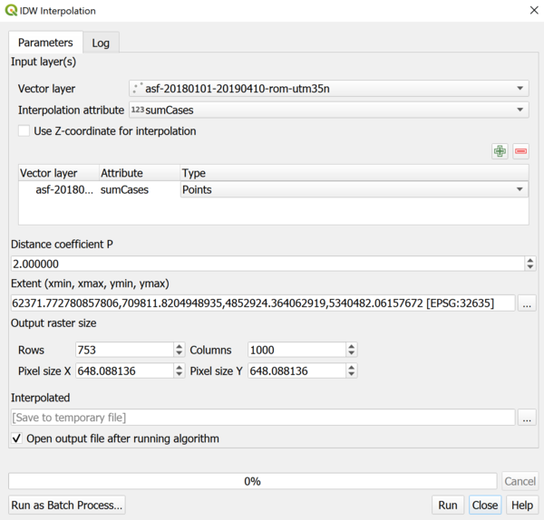

> [GIS fundamentals | Training Course](agenda.md) ▸ **Interpolation techniques: an introduction**


## Targeted skills

By the end of this module, you will:
* how what are the purpose, pros and cons of interpolation technique
* have a general understanding of various interpolation techniques
* know how to interpolate points data (outbreaks) using Inverse Distance Weighted (IDW) technique


## Data
For this module, we will continue using the ASF outbreasks data in Romania.

## Exercise outline & memos
In our use case, the purpose of interpolation is essentially to **estimate** outbreaks related quantities (like sum of cases, ...) 
at locations where no data is available. In essence, we use the information we have to estimate/predict the information we do not have.

There is a wide palette of interpolation techniques. In a nutshell, some of them use only distance-based quantities (like IDW) and others
use probability theory to best harness available information (such as spatial autocorrelation - the closer the more similar). This last
set of techniques covered by the very vast field of study named **Geostatistics** have the advantage to quantify the estimation error. 

Geostatistics would deserve two weeks of training on its own. In this module, we will focus on a very simple technique called **Inverse 
Distance Weighting (IDW)**: for each unknow location, the quantity to estimate (in our case the nb of cases) is calculated based as 
a weighted product of surrounding available measurements. 

It is of the highest importance to realise that interpolation results are very sensitive to algorithms' parameters such as radius of
influence, ... They should be considered as exploration tool. In no case such interpolation techniques should be considered accurate.
In this module, you will generate such interpolation while changing input parameters.

### 1. Creating an IDW interpolation layer

* first open ASF outbreaks data in Romania then:

```
[QGIS Processing Toolbox] 
1. In the search box, type: "interpolation"
2. Then double-click on Interpolation ▸ IDW interpolation
3. And finally reproduce the settings below
```



By now, you should get a new raster layer with interpolated values, now:
* style it (proper color palette)
* modify for instance the "distance coefficient", resolutions (nb. of rows and columns), ...
* what if you use the ASF outbreaks data for south-west Romania (used during day 2) instead?
* clip it using south-west Romania area we've created in day 2


