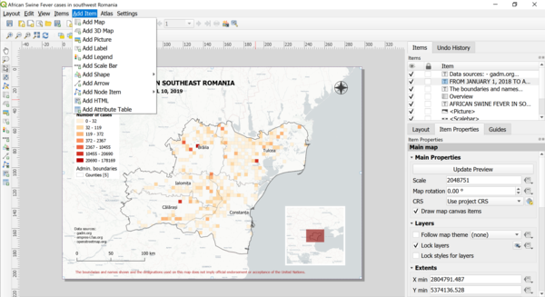

> [GIS fundamentals | Training Course](agenda.md) ▸ **"Publication ready map layout**

## Targeted skills
By the end of this module, you will know how to:
* create a publication ready map
* identify mandatory elements of a paper/static map


## Data
We will use the layers and thematic analysis produced for Southeast Romania in previous modules.

## Exercise outline & memos
The main goal of this module is to exemplify a static/paper map production using QGIS through its dedicated "Print Layout..." design space. The outcome of this module should be a map as shown below:


**A full resolution fdf version of this map can be found [here](https://github.com/franckalbinet/gis-training-jelsa/blob/master/src/img/publication-ready-map.pdf)**

## 1. Accessing the "Print Layout..." environment

To start working on your map, first open the GIS layers of interest (in our case the counties of interest, the number of ASF cases aggregated in a grid, ...). Then:

```
[QGIS Top Menu] 
Project ▸ New Print Layout...
```

You will end up with a new window "Print Layout..." design space where you will insert, manipulate and specify the key items of your maps as show below:



This new window includes a multitude  of icons, menu items, options, ... The whole workflow will be illustrated and exemplified several times live during the workshop. The main idea is the following:

1. Insert the item of your choice (map, legend, scale bar, ...)
2. Each of them accepts a multitude of styling options 

Again, this will be shown live during the workshop. It would require more than 30 screenshots going through avery single options though the main idea remaining simple.

## 2. List of **"mandatory"** items/elements that every single map should include

  1. A meaningfull title describing the **What, Where and When**
  2. A **Map Legend/Key** specifying how visual encodings (colors, ...) are associated to the data
  3. A **Scale Bar**
  4. A **North Arrow**
  5. **Sources** of data used
  6. A **Disclaimer**


