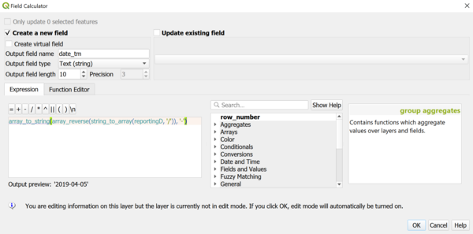
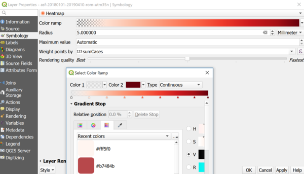
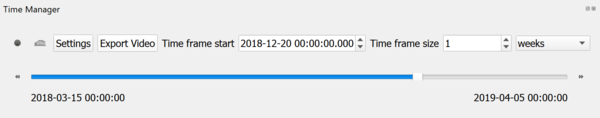

> [GIS fundamentals | Training Course](agenda.md) ▸ **Time Series Animation**

## Targeted skills
By the end of this module, you will know how to:
* prepare a time attribute compliant to TimeManager plugin
* create an animated thematic map based on available time attribute


## Data
* ASF outbreaks data for Romania
* or outbreaks dataset of your choice

## Exercise outline & memos
In this module, we will explore our ASF outbreaks dataset through its time dimension: outbreaks "reporting date". There are basically two ways to visualize the time dimensions:
* using the small-multiple technique (a series of mini maps showing data at different time);
* or time animation.

We will focuse on this second case in this module in order to quickly explore oubtreaks over time in Romania between 2018 and 2019. Such animation is often showcased in online newspapers, blog posts, ... as it is a compelling and convenient way to convey simple messages. Several tools allow to produce such visualization, for instance Carto https://carto.com/ as shown in this example: [Heatmap time animation - Bird Flue cases over time worldwide 2004-2016](https://franckalbinet.carto.com/viz/87f08d5e-953c-11e6-b30e-0e3ebc282e83/embed_map), ...

In this module, we will use **QGIS TimeManager plugin** to quickly explore the time dimension of our dataset. This plugin has been ported to QGIS3 (with few minor bugs but situation might improve in near future) and require some preliminary data preparation as highlighted below.

### 1. Data preparation
This first paragraph raises a very important point: situations where you get **access to clean and analysis-ready dataset rarely occur**. For instance, it is well known and stated that in Data Science, the data cleaning, extraction, manipulation step represent 80% of the work. This can be done with general purpose tools like Excel, ... but it is often much more productive to use dedicated toolboxes like R, Python, ...

Here is our problem. Currently, "TimeManager" plugin only accepted date formatted for instance as `2018-03-25` for instance (yyyy-mm-dd). If you take a look at the `reportingD` attribute, it is formatted as `25/03/2018`. Hence, we need to transform it. To do so we will use QGIS Field Calculator.

Open your outbreaks data of interest and:

```
[In QGIS Top Toolbox]
Click on "Open Field Calculator Icon" (the abacus icon)
and reproduce the setting below with the expression provided
```


Expression to be used: `array_to_string(array_reverse(string_to_array(reportingD, '/')), '-')`

Let's decompose it step by step:
* `string_to_array(reportingD, '/')` changes `"25/03/2018"` to an array `["25", "03", "2018"]`
* `array_reverse(...)` function will transform `["25", "03", "2018"]` to `["2018", "03", "25"]`
* then finally `array_to_string(..., "-")` will transform `["2018", "03", "25"]` to `"2018-03-25"`

Save your layer and don't forget to toggle off the editing mode of your layer.

### 2. Thematic analysis and time dimension
Now that we have a "TimeManager" compliant data/time attribute, let's style our layer. We will use for this example a **heatmap**.

* **Heat map**
See settings below:



Note that "color1" of your "Color ramp" is set to transparent (click on the "Color Ramp" to access this setting).

* **Time animation with TimeManager**

Install and activate the **TimeManager** plugin, then,

```
[In QGIS Top Menu]
Click on Plugins ▸ TimeManager ▸ Toggle visibility
```

By now, you should have a new "TimeManager" panel. 

```
[In QGIS TimeManager panel]
Click on Settings ▸ Add Layer
and reproduce the settings below:
```


Save, specify  the time resolution:



And finally play your animation.


