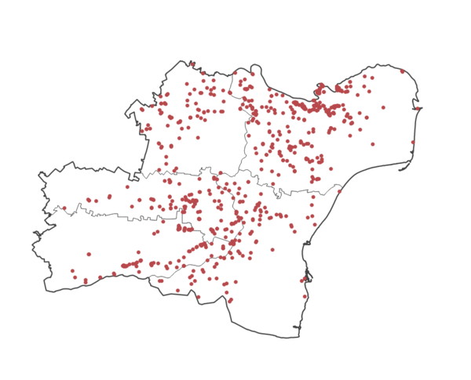

> [GIS fundamentals | Training Course](agenda.md) ▸ **Time Series Animation**

## Targeted skills
By the end of this module, you will know how to:
* prepare a time attribute compliant to TimeManager plugin
* create an animated thematic map based on available time attribute


## Data

## Exercise outline & memos
In this module, we will explore our ASF outbreaks dataset through its time dimension: outbreaks "reporting date". There are basically two ways to visualize the time dimensions:
* using the small-multiple technique (a series of mini maps showing data at different time);
* or time animation.

We will focuse on this second case in this module in order to quickly explore oubtreaks over time in Romania between 2018 and 2019. Such animation is often showcased in online newspapers, blog posts, ... as it is a compelling and convenient way to convey simple messages. Several tools allow to produce such visualization, for instance Carto https://carto.com/ as shown in this example: [Heatmap time animation - Bird Flue cases over time worldwide 2004-2016](https://franckalbinet.carto.com/viz/87f08d5e-953c-11e6-b30e-0e3ebc282e83/embed_map), ...

In this module, we will use QGIS "TimeManager" plugin to quickly explore the time dimension of our dataset. This plugin has been ported to QGIS3 (with few minor bugs but situation might improve in near future) and require some preliminary data preparation as highlitghed below.

### 2. Data preparation

array_to_string(array_reverse(string_to_array(reportingD, '/')), '-')

Your tasks:

1. Select counties of interest and save it as new layer
2. Select ASF outbreaks data covered by this new area of interest
3. Save it as a new layer

Once, this is done, we would like to create a new layer with one single feature/polygon representing the contour of the area formed by 5 counties selected. This transformation is called **dissolving**. 

```
[In QGIS Processing Toolbox]
Write "dissolve" in the search box
and double-click on Vector geometry  ▸ Dissolve 
Choose the layer of interest and "Run"
Save it as new layer
```

By now, you should have three new layers (see screenshot below):
* the ASF outbreaks for these 5 counties
* the 5 counties selected as a new layer
* a layer with one single feature representing the contour of these 5 counties




### 2. Generate and clip a grid
