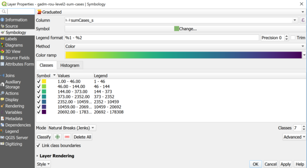

> [GIS fundamentals | Training Course](agenda.md) ▸ **Zonal statistics and thematic mapping**


## Targeted skills

By the end of this module, you will know how to:
* aggregate outbreaks statistics at "commune" level (sum, mean, ...)
* create thematic maps: choropleth maps & proportional circles

## Data
Data to be used in this module are:
* ASF (African Swine Fever) outbreaks reprojected and focused on Romania produced in previous modules
* `data/gadm36_ROU_shp/gadm36_ROU_1.shp`
* and `data/gadm36_ROU_shp/gadm36_ROU_2.shp`

## Exercise outline & memos

### 1. Calculating zonal statistics
To report the outbreaks situation, it is often required to do so at various administrative levels. For instance, to report the number of cases in each "commune" in Romania (administrative level 2 of our dataset).

After having opened the three layers required, to perform this aggregation in QGIS:

```
[In QGIS Processing Toolbox] 
1. In the search box, type: "join attributes by location"
2. Then reproduce the settings below with
  * "SumCases" as "Fields to summarise " and
  * "sum" as "Summaries to calculate..."
3. Save the generated layer with a meaningful name
```


### 2. Creating a thematic map
**Note:  To fully understand the rationale behind the following setting choices, you should attend the "Thematic Mapping" mini-lecture.**

Now that we have calculated the sum of "SumCases" at commune level, we would like to spatialize this quantitative data at country scale.

To produce a thematic map of the newly generated layer:
```
[In QGIS Layer Panel] 
1. Click right on the Layer  ▸ Properties... or simply double-click on the layer
2. Then reproduce the settings below for the "Symbology tab"
```



Save your work as a QGIS project.

### 3. Avoiding perception bias
There is one issue with the thematic map produced previously: it might visually over emphasize the largest commune whatever the quantitative value to map. It is usually considered a bad practice to produce "Choropleth" maps for absolute quantitative data (though very common). Instead, we prefer to "normalize" by calculating for instance in our case a density: **the number of cases by km<sup>2</sup>**.

Hence, the first thing to do is to calculate the area (in km<sup>2</sup>) for each commune:

```
First, ensure to specify the proper unit for surface calculation
[In QGIS Top Menu] 
Project ▸ Properties... ▸ General (tab)
Specify km<sup>2</sup> as "Unit for area measurement"
```

Now, let's compute the area of each features (polygons of administrative level 2, i.e communes):

```
[Layer's attribute table field calculator] 
Reproduce the settings below:
```


Finally, again in:

```
[Open Field calculator in QGIS Top Toolbox] 
Create a new field/attribue named "cases_km2" with the total number of cases / area
Then perform a new thematic analysis with the newly created field
```


### 4. Thematic map with proportional circles
As seen during the "Thematic mapping" introduction lecture, using "size-related" visual encodings is often the more effective way to represent quantitative data (such as number of cases for instance). 

In this paragraph, we will create a "proportional circles" map for aggregated number of cases at commune level.

```
[In QGIS Layer Panel] 
1. Click right on the Layer  ▸ Properties... or simply double-click on the layer
2. Then for the "Symbology tab", select "No symbols"
3. Then click on "Diagrams" tab and reproduce the series of settings below:
```

* **Select "Pie chart" and attribute of interest**


* **Adjust opacity, rendering**


* **Adjust opacity, rendering**


* **Placement**


You should now obtain a thematic layer looking like the one below:


**How could we improve (at least in two ways) the map produced above?**


